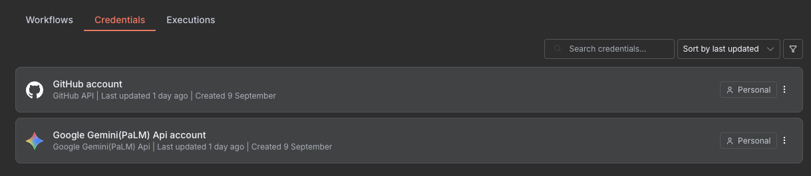
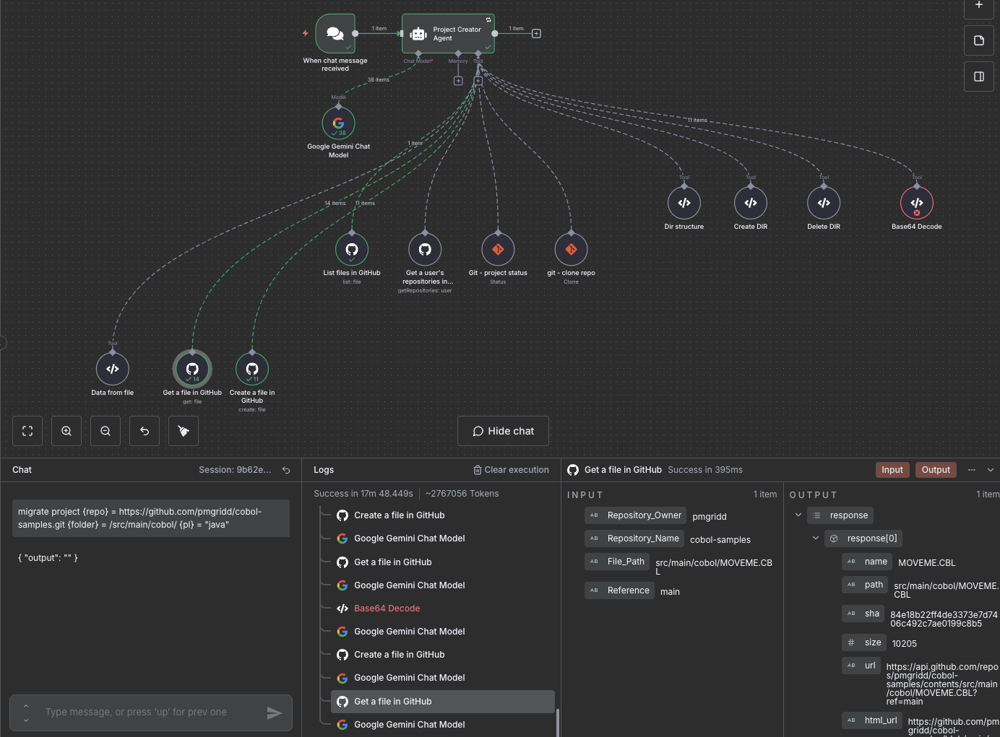

## Run project 

BASE_PATH=. docker-compose up  --build

## Setup
- setup auth user for n8n 
- import workflow "workflows/Code migrator.json"
- setup gemini (or your llm), github tokens, set these credentials to all required nodes:

## Example project
https://github.com/pmgridd/cobol-samples/tree/main/src/main/cobol

## Agent prompt: 

{{ $json.chatInput }}

You are highly trained specialist who can migrate any code to any other languages and platforms. 

For project {repo} complete a code migration under folder {folder} (determine original language) of specific files to programming language {pl}. If you see one file, not a folder, just migrate this file. Make sure all proper configuration and build tools configs for the target generated as well. language Retry several times and verify if files exist. Important logic approach steps:

1. Iterate over all file under folder {folder} and it's subfolders, formulate a list of files to migrate in a form of dir structure like: /folder1/subfolder1/file1, /folder2/file2, etc. Ignore files like documentation, exec files - consider only important with code;

2. Using github tools, extract content of the file, use Base64 decode tool to get content of the files;

3. Migrate files to code language {pl}, store results of each file in similar structure within the same github repository with folder structure prefix {pl}, example: {pl}/folder1/subfolder1/file1, {pl}/folder2/file2, etc (use create file in github tool for this);

4. upload and commit code to same {repo}, if it fails, tey to verify if file exist and edit it in same {repo};

5. generate configuration and setup files for target language with respective dependencies mentioned in migrated files under folder structure prefix {pl}; 
6. upload and commit configuration to same {repo};

7. make sure all files created and uploaded to github;

## Agent input example

migrate project {repo} = https://github.com/pmgridd/cobol-samples.git {folder} = /src/main/cobol/ATTRACT.CBL {pl} = "java"

